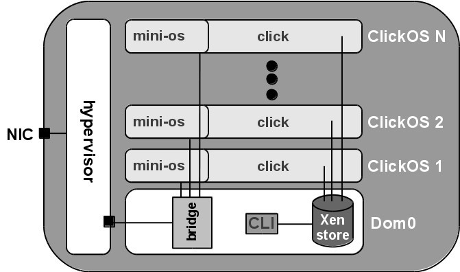
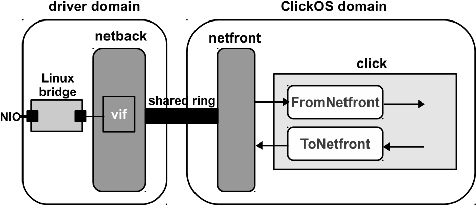
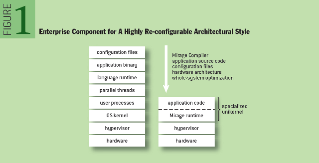
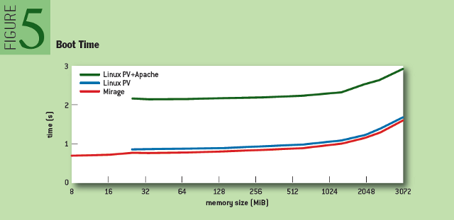
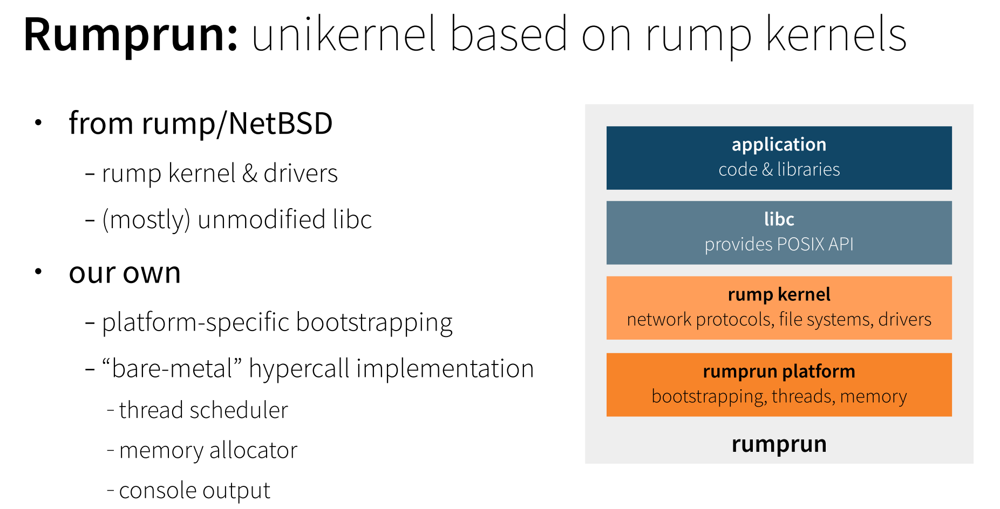

# Runikraft 调研报告

[TOC]

## 项目简介

本项目参考 Unikraft 的设计，用 Rust 语言实现模块化的 unikernel，在保持 Unikraft 的 POSIX 兼容性、可定制性的基础上，用 Rust 语言增强内核的安全性。参考项目：[unikraft](https://github.com/unikraft/unikraft)

本调研报告分为4个主要部分：Rust语言的优越性（郭耸霄调研）、当前时代的unikernel项目整理（陈建绿、蓝俊玮调研）、往年OSH-20xx课程小组的unikernel项目整理（吴骏东调研），以及unikernel的安全性问题（张子辰调研）。

## Rust语言的优越性

这一部分主要阐释我们为什么选择Rust语言作为开发语言。Rust 是由 Mozilla 研究室主导开发的一门现代系统编程语言，自 2015 年 5 月发布 1.0 之后，一直以每 6 周一个小版本的开发进度稳定向前推进。语言设计上跟 C++ 一样强调零开销抽象和 RAII。拥有极小的运行时和高效的 C 绑定，使其运行效率与 C/C++ 一个级别，非常适合对性能要求较高的系统编程领域。利用强大的类型系统和独特的生命周期管理实现了编译期内存管理，保证内存安全和线程安全的同时使编译后的程序运行速度极快，Rust 还提供函数式编程语言的模式匹配和类型推导，让程序写起来更简洁优雅。宏和基于 trait 的泛型机制让 Rust 的拥有非常强大的抽象能力，在实际工程中尤其是库的编写过程中可以少写很多 boilerplate 代码。[^2]总地来说，Rust是一门赋予每个人 构建可靠且高效软件能力的语言。[^1]它具有以下三个方面的优越性：

### 高性能（Performance）

Rust 速度惊人且内存利用率极高。由于没有运行时和垃圾回收，它能够胜任对性能要求特别高的服务，可以在嵌入式设备上运行，还能轻松和其他语言集成。[^1]

- 可执行文件：
  Rust是编译语言，这意味着程序直接转换为可执行的机器代码，因此可以将程序作为单个二进制文件进行部署；与 Python 和 Ruby 等解释型语言不同，无需随程序一起分发解释器，大量库和依赖项，这是一大优势。与解释型语言相比，Rust 程序非常快。[^4]

- 对动态类型语言与静态类型的平衡：
  动态类型语言在调试、运行时具有不确定性，而静态类型的语言减少了程序理解的开销和动态运行的不确定性，但并不是所有静态类型系统都是高效的。Rust使用可选类型对这种可能性进行编码，并且编译器要求你处理`None`这种情况。这样可以防止发生可怕的运行时错误（或等效语言），而可以将其提升为你在用户看到它之前解决的编译时错误。Rust的静态类型尽最大努力避免程序员的麻烦，同时鼓励长期的可维护性。一些静态类型的语言给程序员带来了沉重的负担，要求他们多次重复变量的类型，这阻碍了可读性和重构。其他静态类型的语言允许在全局进行数据类型推断。虽然在最初的开发过程中很方便，但是这会降低编译器在类型不再匹配时提供有用的错误信息的能力。Rust可以从这两种样式中学习，并要求顶层项（如函数参数和常量）具有显式类型，同时允许在函数体内部进行类型推断。[^3]

- 解决垃圾回收问题：
  Rust可以选择将数据存储在堆栈上还是堆上，并在编译时确定何时不再需要内存并可以对其进行清理。这样可以有效利用内存，并实现更高性能的内存访问。Tilde是Rust在其Skylight产品中的早期生产用户，他发现通过使用Rust重写某些Java HTTP服务，他们能够将内存使用量从5Gb减少到50Mb。无需连续运行垃圾收集器，Rust项目非常适合被其他编程语言通过外部功能接口用作库。这使现有项目可以用快速的Rust代码替换对性能至关重要的代码，而不会产生其他系统编程语言固有的内存安全风险。某些项目甚至已使用这些技术在Rust中进行了增量重写。通过直接访问硬件和内存，Rust是嵌入式和裸机开发的理想语言你您可以编写底层代码，例如操作系统内核或微控制器应用程序。在这些特别具有挑战性的环境中，Rust的核心类型和功能以及可重用的库代码表现将会非常出色。[^3]


### 可靠性（Reliability）

Rust 丰富的类型系统和所有权模型保证了内存安全和线程安全，让您在编译期就能够消除各种各样的错误。[^1]

- 处理系统级编程：
  与其他系统级编程语言（例如C或C ++）相比，Rust可以提供的最大好处是借阅检查器。这是编译器的一部分，负责确保引用不会超出引用的数据寿命，并有助于消除由于内存不安全而导致的所有类型的错误。与许多现有的系统编程语言不同，Rust不需要你将所有时间都花在细节上。Rust力求拥有尽可能多的*零成本抽象*，这种抽象与等效的手写代码具有同等的性能。当安全的Rust无法表达某些概念时，ref="[http://cliffle.com/p/dangerust/](https://link.zhihu.com/?target=http%3A//cliffle.com/p/dangerust/)">可以使用不安全的 Rust。这样可以释放一些额外的功能，但作为交换，程序员现在有责任确保代码真正安全。然后，可以将这种不安全的代码包装在更高级别的抽象中，以确保抽象的所有使用都是安全的。使用不安全的代码应该是一个经过深思熟虑的决定，因为正确使用它需要与负责避免未定义行为的任何其他语言一样多的思考和关心。最小化不安全代码是最小化由于内存不安全而导致段错误和漏洞的可能性的最佳方法。系统性编程语言有一种天生的使命，即它们必须永远有效地存在。尽管某些现代软件并不需要那么长的使用寿命，但许多企业希望其辛苦编写代码库在可预见的将来能够一直使用。[^3]

- Concurrent programming made easier：
  Rust makes it easier to write concurrent programs by preventing data races at compile time. A data race occurs when at least two different instructions from different threads are trying to access the same memory location simultaneously, while at least one of them is trying to write something and there is no synchronization that could set any particular order among the various accesses. Access to the memory without synchronization is undefined. In Rust, data races are detected. If a given object access does not support many threads ( i. e. is not marked with an appropriate trait), it needs to be synchronized by a mutex that will lock access to this particular object for other threads. To ensure that operations performed on an object will not break it, only one thread has access to it. From the perspective of other threads, operations on this object are atomic, which means that an observed state of the object is always correct and you cannot observe any intermediate state resulting from an operation performed on this object by another thread. Rust language can check if we are performing any incorrect operations on such objects and inform us at compile time.[^6]

### 生产力（Productivity）

Rust 拥有出色的文档、友好的编译器和清晰的错误提示信息， 还集成了一流的工具——包管理器和构建工具， 智能地自动补全和类型检验的多编辑器支持， 以及自动格式化代码等等。[^1]

- Cargo包管理器：
  Rust 由于有 Cargo 这样一个非常出色的包管理工具，周边的第三方库发展非常迅速，各个领域都有比较成熟的库，比如 HTTP 库有 Hyper，异步 IO 库有 Tokio, mio 等，基本上构建后端应用必须的库 Rust 都已经比较齐备。 总体来说，现阶段 Rust 定位的方向还是高性能服务器端程序开发，另外类型系统和语法层面上的创新也使得其可以作为开发 DSL 的利器。[^2]
  Cargo is recognized as one of the exceptional strengths of the Rust ecosystem. Without Cargo, we would have had to search for libraries, download these libraries from unknown sources from GitHub, build as static library crates, link them against the program. How painful this is all to do. But we have Cargo that does all this for us while working with Rust.[^7]

### Rust语言的兼容性

The Rust language is fast evolving, and because of this certain compatibility issues can arise, despite efforts to ensure forwards-compatibility wherever possible.

Rust, like many programming languages, has the concept of "keywords". These identifiers mean something to the language, and so you cannot use them in places like variable names, function names, and other places. Raw identifiers let you use keywords where they would not normally be allowed. This is particularly useful when Rust introduces new keywords, and a library using an older edition of Rust has a variable or function with the same name as a keyword introduced in a newer edition.

For example, consider a crate `foo` compiled with the 2015 edition of Rust that exports a function named `try`. This keyword is reserved for a new feature in the 2018 edition, so without raw identifiers, we would have no way to name the function.[^8]

### 相比其他语言Rust的优势

- Go：Rust语言表达能力更强，性能更高，同时线程安全方面Rust也更强，不容易写出错误的代码，包管理Rust也更好，Go虽然在1.10版本后提供了包管理，但是目前还比不上Rust的。

- C++：与C++相比，Rust的性能相差无几，但是在安全性方面会更优，特别是使用第三方库时，Rust的严格要求会让第三方库的质量明显高很多。语言本身的学习，Rust的前中期学习曲线会更陡峭，但是对于未来使用场景和生态的学习,C++会更难、更复杂。

- Java：除了极少部分纯粹的数字计算性能，Rust的性能是全面领先于Java的，同时Rust占用内存小的多，因此实现同等规模的服务，Rust所需的硬件成本会显著降低。

- Python：性能自然是Rust完胜，同时Rust对运行环境要求较低，这两点差不多就足够抉择了，因为python和rust的彼此适用面其实不太冲突。[^5]

## 当前时代unikernel项目调研总结

### ClickOS[^12][^13]

ClickOS 是一个基于 Xen 的高性能地虚拟化软件中间盒平台。为了达到高性能，ClickOS 对 Xen 的 I/O 子系统实现了广泛的翻修，包括对后端交换机、虚拟网络设备和后端前端驱动程序。这些更改使 ClickOS 能够显著加快中间盒运行时的网络连接。

ClickOS 虚拟机很小(5mb) ，启动速度很快(大约30毫秒) ，只需要很少的延迟(45微秒) 。ClickOS 可以将网络功能虚拟化变成现实：它在商品硬件上运行数百个中间盒，提供每秒数百万个数据包的处理速度并产生低数据包延迟。ClickOS 证明软件解决方案本身就足以显着加快虚拟机处理速度，达到剩余开销的地步与将异构中间盒处理安全地整合到同一硬件上的能力相形见绌。

ClickOS 的主要贡献是采用 Click 作为中间盒的主要编程抽象并创建量身定制的客户操作系统运行 Click 配置。这种专业化使我们能够优化中间盒的运行时间以适应他们以毫秒为单位启动的点，同时允许我们支持广泛的功能。ClickOS 实现了广泛的中间盒，包括防火墙、运营商级 NAT 和负载均衡器，并证明 ClickOS 可以每秒处理数百万个数据包，达到生产级性能。

ClickOS 可以帮助测试和部署通过将流子集引导到运行实验代码的 VM 来获得新功能；功能问题会那么只影响一小部分流量，甚至虚拟机 崩溃不会是一个大问题，因为它们可以在几毫秒内重新实例化。 

ClickOS 的架构如图：



Basic ClickOS networking in Xen：




### MirageOS[^11]

MirageOS 是一个基于 OCaml 语言，发行在 Xen hypervisor，用于在各种云计算和移动平台构建安全、高性能网络应用程序的库操作系统。它可以将大型服务器划分为很多更小的虚拟机，使得服务器具有更强的拓展性和安全性。其代码可以在 Linux 、Mac OS 等系统中开发，然后编译成一个完全独立的、专门的内核在 Xen 或者 KVM hypervisors 和 轻量级 hypervisors 下运行。MirageOS 已经发展成为一个由近100个开放源码库组成的成熟库，实现了一系列广泛的功能，并且正开始与 Citrix XenServer 等商业产品集成。其工作原理如下，MirageOS 将 Xen hypervisors当成一个稳定的硬件平台，让我们可以专注于实施高性能协议，没必要为支持传统操作系统里面的成千上万个设备驱动程序而操心。

MirageOS 的架构如图1



其逻辑工作流如图2。来自源代码(本地和全局库)和配置文件的精确依赖性跟踪使得已部署的内核二进制文件的完整出处被记录在不可变数据存储中，足以根据需要精确地重新编译。


图2说明了 MirageOS 的设计。与传统的云部署周期相比，它赋予编译器更广泛的源代码依赖视角:

- 输入应用程序的所有源代码依赖项都被显式跟踪，包括实现内核功能所需的所有库。MirageOS 包括一个构建系统，该系统内部使用一个 SAT 解算器(使用 OPAM 包管理器，使用 Mancoosi 项目的解算器)从一个已发布的在线包集中搜索兼容的模块实现。由于 OCaml 的静态类型检查，在编译时将捕获接口中的任何不匹配。
- 编译器可以输出一个完整的独立内核，而不仅仅是一个 Unix 可执行文件。这些统一内核是单用途的 libOS 虚拟机，它们只执行应用程序源文件和配置文件中定义的任务，并且它们依赖于管理程序来提供资源复用和隔离。甚至启动装载程序(它必须设置虚拟内存页表并初始化语言运行时)也是作为一个简单的库编写的。每个应用程序都链接到它需要的特定库集合，并可以以特定于应用程序的方式将它们粘合在一起。
- 专门的单一内核部署在公共云上。与传统的虚拟化等价物相比，它们的攻击面要小得多，并且在引导时间、二进制大小和运行时性能方面更具资源效率。

在 MirageOS 中，OCaml 编译器接收整个内核代码的源代码，并将其链接到一个独立的本机代码对象文件。它链接到提供引导支持和垃圾回收器的最小运行时。没有抢占式线程，内核是通过一个 I/O 循环轮询 Xen 设备的事件驱动的。

图5比较了 MirageOS 和 Linux/Apache 发行版中服务的引导时间。简化的 Linux 内核和 MirageOS 的启动时间是相似的，但一旦需要初始化用户空间应用程序，效率低下的问题就会蔓延到 Linux。一旦启动，MirageOS unikernel 就可以提供通信服务。




### IncludeOS[^9][^10]

IncludeOS 是一个为开发基于 unikernel 的应用程序而创建 c + + API 的项目。当使用 IncludeOS 构建应用程序时，开发工具链将链接到运行应用程序所需的 IncludeOS 库的各个部分，并创建带有引导加载程序的磁盘映像。一个 IncludeOS 映像可以比运行同等程序的 Ubuntu 系统映像小几百倍。映像的启动时间为数百毫秒，这使得快速启动许多此类虚拟机映像成为可能。

当 IncludeOS 映像引导时，它通过设置内存、运行全局构造函数、注册驱动程序和中断处理程序来初始化操作系统。在 IncludeOS unikernel 中，不启用虚拟内存，应用程序和 unikernel 库使用单个地址空间。因此，没有系统调用或用户空间的概念; 所有操作系统服务都通过对库的简单函数调用来调用，并且都以特权模式运行。

1. IncludeOS 有如下优点：

- 性能优良，启动迅速，能在几十毫秒之内启动。
- 可移植性好，运行在虚拟机上。
- 安全性好，镜像中没有冗余代码。
- 体积小，只需很小的磁盘和内存。
- 支持在裸机上运行。
- 延迟很低。目前没有进程抢占，操作系统的行为非常静态，所以只要机器本身是可预测的，延迟也将是完全可预测的。因此，在裸机硬件上，IncludeOS可被视为低延迟，可预测的操作系统。
- 对网络的支持很好，与 Linux 相比表现出色。
- IncludeOS 系统作为一个整体进行编译和优化。在编译器和连接器阶段，优化器可以更多地了解整个系统正在做什么，并且有可能进一步优化。
- IncludeOS 中的所有 IRQ 处理程序将简单地(原子地)更新计数器，并在有时间时将进一步的处理推迟到主事件循环。这消除了对上下文切换的需要，同时也消除了与并发相关的问题，如竞争条件。通过使所有 I/O 都是异步的，CPU 保持忙碌，这样就不会发生阻塞。

2. IncludeOS 有如下缺点：

- IncludeOS 不实现所有 POSIX。开发人员认为，只有在需要时才会实现 POSIX 的某些部分。开发人员不太可能将完全遵守 POSIX 作为一个目标。
- 目前，IncludeOS 中没有实现阻塞调用，因为当前的事件循环模型是使用它的最佳方式。
- IncludeOS 目前还缺少可写的文件系统。


### RustyHermit[^14][^15][^16][^17]

RustyHermit([Github](https://github.com/hermitcore/rusty-hermit)) 是一个基于 Rust 的、轻量级的 Unikernel。它用 Rust 语言完全改写了 RWTH Aachen University 开发的研究项目 [HermitCore](http://hermitcore.org/)。

> HermitCore 最初是用 C 语言编写的，是一种针对高性能和云计算的可伸缩和可预测的运行时的 Unikernel。

该项目完全使用 Rust 语言开发，**Rust 的所有权模型保证了它的内存/线程安全**，并且让开发者能够在编译时就消除许多种 bug。因此，与通用编程语言相比，使用 Rust 进行内核开发会留下更少的漏洞，得到更加安全的内核。

开发者**扩展了 Rust 工具链**以至于 RustyHermit 的 build 过程与 Rust 通常的工作流程相似。使用 Rust runtime 而且不直接使用 OS 服务的 Rust 应用程序能够直接在 RustyHermit 上运行而不需要修改。因此，**原则上，每一个现有的 Rust 应用程序都可以建立在 RustyHermit 之上**。

> Rust runtime，翻译过来称为 Rust 运行时。其中 runtime 这个词在维基百科中的定义如下：
>
> - In computer science, **runtime**, **run time**, or **execution time** is <u>the final phase of a computer program's life cycle</u>, in which the code is being executed on the computer's central processing unit (CPU) as machine code. In other words, "runtime" is the running phase of a program.
>
> 由此可以将 runtime 简单理解为**程序代码被 CPU 执行的那段时间**。

RustyHermit 中**优化实现了网络栈**。它使用 [smoltcp](https://github.com/smoltcp-rs/smoltcp) (Rust 语言编写) 作为它的网络栈，使用 [Virtio ](https://www.linux-kvm.org/page/Virtio) (KVM 的准虚拟化驱动程序，广泛应用于虚拟化 Linux 环境中) 作为客户机和主机操作系统之间的接口。将RustyHermit 和 Linux 分别作为客户端运行在基于 Linux 的主机系统上的虚拟机中，以信息的比特数作为自变量，吞吐量/Mbps作为因变量，进行测试并绘图，结果如下：[^20]


由结果图可以看出，**RustyHermit 在信息比特数较小时吞吐量明显比 Linux 更快**。

RustyHermit 也是一个用来评估操作系统新的设计的研究项目。比如，RustyHermit 提供了一些经典的技术来提升像堆栈保护、应用程序堆栈与操作系统库堆栈分离等行为的安全性。但是，库操作系统通常使用一个普通函数调用进入内核，传统的通过进入更高的权限级别来将用户空间和内核空间分离的做法是被遗漏了的。

有[一篇论文](../../references/Intra-Unikernel Isolation with Intel Memory Protection Keys.pdf)中提出了**一个修改版本的 RustyHermit**，该版本提供了一个**使用 Intel MPK**(Memory Protection Keys)**进行内部隔离**的Unikernel。这篇论文的摘要如下（中英文对照）：[^18][^19]

> Abstract：
>
> Unikernels are minimal, single-purpose virtual machines. This new operating system model promises numerous benefits within many application domains in terms of lightweightness, performance, and security. Although the isolation between unikernels is generally recognized as strong, there is no isolation within a unikernel itself. This is due to the use of a single, unprotected address space, a basic principle of unikernels that provide their lightweightness and performance benefits. In this paper, we propose a new design that brings memory isolation inside a unikernel instance while keeping a single address space. We leverage Intel’s Memory Protection Key to do so without impacting the lightweightness and performance benefits of unikernels. We implement our isolation scheme within an existing unikernel written in Rust and use it to provide isolation between trusted and untrusted components: we isolate (1) safe kernel code from unsafe kernel code and (2) kernel code from user code. Evaluation shows that our system provides such isolation with very low performance overhead. Notably, the unikernel with our isolation exhibits only 0.6% slowdown on a set of macrobenchmarks.
>
> 译：
>
> Unikernels 是最小的、单一用途的虚拟机。这种新的操作系统模型在许多应用程序领域中承诺了轻量化、性能和安全性方面的许多好处。虽然 Unikernels 之间的隔离通常被认为是很强的，但是在 Unikernels 本身内部并没有隔离。这是因为使用了单一的、不受保护的地址空间，这是提供轻量级和性能优势的 Unikernels 的基本原则。在本文中，我们提出了一种新的设计，即在保持单一地址空间的同时，在 Unikernel 实例中引入内存隔离。我们利用 Intel 的内存保护密钥(MPK)来做到这一点，而不会影响 Unikernels 的轻量化和性能优势。我们在<u>现有的用 Rust 编写的 Unikernel</u> 中实现了我们的隔离方案，并使用它来提供可信和不可信组件之间的隔离：(1)安全内核代码与不安全内核代码之间的隔离，(2)内核代码与用户代码之间的隔离。评估表明，我们的系统以非常低的性能开销提供了这种隔离。值得注意的是，在一组宏基准测试中，带有隔离功能的 unikernel 仅减慢了0.6%。

> **注**：上面提到的“<u>现有的用 Rust 编写的 Unikernel</u>”就是指 RustyHermit。

这篇论文中的内容可以作为我们实现 runikraft 的参考。

### Rumprun

Rumprun unikernel 是在 rump kernels 的基础上开发的。Rumprun 不仅可以**在像 KVM 和 Xen 这样的管理程序上工作**，还**可以在裸金属上工作**。**无论有没有 POSIX-y 接口，Rumprun 都可以正常使用**。如果有 POSIX-y 接口，Rumprun 则允许现有的、未经修改的 POSIX 应用程序开箱即用；如果没有 POSIX-y 接口，Rumprun 则允许构建高度自定义的解决方案，并且占用的空间最小。

Rumprun unikernel 支持用 c、 c + + 、 Erlang、 Go、 Java、 Javascript (node.js)、 Python、 Ruby 和 Rust 等语言编写的应用程序。

在 [rumprun-packages repository](https://github.com/rumpkernel/rumprun-packages) 中可以找到用于 Rumprun 的现成软件包，比如 *LevelDB*, *Memcached*, *nanomsg*, *Nginx* 和 *Redis*。

1. Rump kernels 的相关介绍[^21][^22]

Rump kernels 的目标并不是搭建一个 unikernel，它的目标是提供可重用的内核组件，其他组件可以在此基础上进行构建。开发者的目标是让每个使用它们组件的项目都不用去花费精力维护轮子。

Rump kernels 的组件来自未经修改的 NetBSD，由此开发者提供了一个 POSIX-y API。Rump Kernel 项目以一种可用于构建轻量级、特殊用途虚拟机的形式提供了 NetBSD 的模块化驱动程序。因为开发者没有做会将错误引入到应用程序运行时(application runtime)、 libc 或驱动程序中的移植工作，所以程序可以很稳定地工作。下面这张图片阐述了 Anykernel、Rump kernel 和 Rumprun Unikernel 的关系：


> “Anykernel”概念指的是一种与架构无关的驱动程序方法，在这种方法中，驱动程序既可以编译到宏内核中，也可以作为用户空间进程运行，具有微内核风格，并且不需要修改代码。——来自维基百科

2. Rumprun 的相关介绍[^23][^24]

目前已经有很多 Unikernel 项目，它们的实现方式大致可以分为两种：

- 全新的方式(Clean-slate)：在构建单一用途的操作系统的假设下，自由地使用现代工具来进行构建，比如模块化(modularity)、声明性代码(declarative code)、避开样板文件(avoiding boilerplate)等。并且从头开始思考操作系统和应用程序层的实现，使用高级语言进行系统库的编写，从而使得实现更加可掌控，得到的系统库质量更高。
- 传统的方式(Legacy)：在不进行修改或只进行一些小的修改的前提下，运行现有的软件。这通常通过将现有的操作系统代码库重构到库操作系统中来实现。

用 OCmal 语言编写的 MirageOS Unikernel 就是使用 Clean-slate 方式实现的，而用 C 语言编写的 Rumprun Unikernel 则是使用 Legacy 方式实现的。

Rumprun 可用于将几乎任何与 POSIX 兼容的程序转换为一个可工作的 Unikernel。使用 Rumprun，理论上可以将 Linux 或者 类Unix系统上的大部分程序编译成 Unikernel。Rumprun 以开发 NetBSD 内核中的驱动程序并在用户空间中进行测试的需求为出发点，主要的工作是重构这个代码库，使其看起来像一个库操作系统。

下面是 Rumprun 的**架构图**：



Rumprun 也有一些**限制**：

- **single address-space**
  - no processes
  - no virtual memory
  - no signals
- **toolchain**
  - still experimental
- **threading**
  - cooperative
  - single-core
    - need to spawn multiple unikernels to use multiple cores

下图是 Rumprun 的一个**工作流程示例图**：


我在调研的过程中发现，rump kernel 的好多官方文档都会重定向到https://rumpkernel.org这个网址，而这个网址目前只有一些 IT News，并非和 rump kernel 相关的内容，所以**猜测该项目目前已经无人维护**。

此外，我在调研过程中还**发现一个比较新的正在开发中的 Unikernel**：[Nanos(Github)](https://github.com/nanovms/nanos)。下面是它的一些介绍：

> Nanos 是一个新的内核，旨在虚拟化环境中运行一个且仅有一个应用程序。与 Windows 或 Linux 等通用操作系统相比，它有几个限制——即它是一个单进程系统，不支持运行多个程序，也不具备通过 ssh 进行用户或远程管理的概念。
>
> Nanos 的目标是成为一个比 Linux 安全得多的系统。它做到这一点的几个依赖：**没有用户的概念**，**每个虚拟机只运行一个进程**，**限制每个虚拟机中包含的代码数量**。
>
> Nanos 并不打算在裸金属上运行，所以开发者努力使**其内核尽可能简单**。

这也许会对我们的项目有所帮助。

## 往年OSH-20xx课程小组的unikernel项目整理

### x-unipanic小组

1. 项目简介

​		该项目旨在已有项目的基础上，小组希望在保持 Unikernel 现有优势（高效、安全、轻量）的前提下，改善 Unikernel 对二进制程序的支持，做出可以即时打包、分发的 Unikernel。目前致力于提供二进制兼容性的 Unikernel 项目 **HermiTux** 仍有较大改进空间，因此该小组将改善 **HermiTux** 二进制兼容性作为立项目标。

关键词：UniKernel, 进程调度

参考项目：[HermiTux](https://github.com/ssrg-vt/hermitux)

2. 项目可行性分析

- 目前的 Unikernel 实现均要求对应用的重构，在实际应用中无法获取程序源码、程序依赖未被支持等问题非常常见
- 将应用打包为 Unikernel 要求大量的专业知识，步骤繁琐
- HermiTux设计了一个二进制分析工具，能够扫描一个可执行文件，并检测该程序可以进行的各种系统调用
- HermiTux基于[hermitcore](https://github.com/hermitcore/rusty-hermit)这一Unikernel架构做了二进制支持，并重写syscall以保证性能。
- HermiTux的内核中实现了一个基本的RAM文件系统——MiniFS，从而在这方面消除了对主机的依赖。

3. 项目困难点分析

- 如果无法获得程序源代码，重新编译和链接将无从进行，也就不可能打包到 Unikernel。对二进制文件的逆向往往会因为编译过程中的剥离和混淆难以进行，因此用unikernel层进行拆解和重新链接是不合适的。
- 让 Unikernel 支持某种语言十分困难，Unikernel 通常只支持一小部分的内核特性和软件库。如果语言用到了不支持的内容，就需要重写应用，很多情况下这意味着应用完全不可能被移植。
- Unikernel 使用复杂的构建工具，将一些传统应用的大型构建基础架构（大量的 Makefile、autotools/cmake 环境）加入 Unikernel 工具链是十分麻烦。并且，unikernel还缺乏一些开发工具，如调试器（debugger）和分析工具（profiler）。

4. 项目成果分析

​		该小组主要参照了KylinX和Hermitux这两个项目。KylinX项目提供实现fork的思路；Hermitux主要实现Unikernel的二进制支持，可以在Hermitux的源码上进行改动。主要的成果有：

1. 支持fork。参照了KylinX实现fork的方式，通过复制hypervisor启动新的虚拟机作为子进程。但是这样实现的性能较低，增大了系统负担。

2. 优化重写syscall。修改了syscall打包的判断方式，将向后打包扩展成向前打包，从而100%重写了syscall函数。保持Unikernel因没有系统调用而具有的优良运行速度。


### x-KATA-Unikernel 小组

1. 项目简介

​		该项目利用 Unikernel 得天独厚的轻量和攻击面小的特性，结合虚拟化技术，为FaaS（Function As A Service）场景下的云服务提出一种解决方案：从客户端提交代码，到云平台进行 Serverless 运算。采用 KVM 的虚拟机接口，在虚拟化环境中以 Unikernel 减少资源开销，达到空间的高效利用和速度的极限提升。

关键词：UniKernel, 虚拟化, 云计算

参考项目：[Kata](https://github.com/kata-containers/kata-containers)、[gVisor](https://github.com/google/gvisor/blob/master/README.md)、[Firecracker文档](https://firecracker-microvm.github.io/)

2. 项目可行性分析

- Firecracker 是在 rust 众多 crates 基础上实现的 VMM。它拥有非常有限的设备模型，提供轻量级的服务并且暴露的攻击面极小，在 FaaS 场景下有极大的应用空间。但其本质上还是传统的虚拟机架构，不可避免地带来多层嵌套的性能损耗。
- Google 提出的 gVisor 解决方案， 在容器的后端将所有的系统调用截断，凭借 gVisor 中用户程序来实现系统调用的API。 gVisor 极其轻量，隔离性相对不足。此外，其也面临着过多系统调用时无法忍受的上下文转换问题。并且，gVisor 采用了带有 GC 的 Go 语言编写，也有比较大的性能开销。
- Unikernel 的缺点可以被 kata Container易于分发的优点改善，同时纳入 kubernetes 生态，使得 Unikernel 的应用更加广泛。
- KVM 是采用硬件虚拟化技术的全虚拟化解决方案。其优势有：依赖 Linux 内核的内存管理、存储和客户机镜像格式多样、支持实时迁移与状态保存、支持高性能I/O接口、性能极强等。

3. 项目困难点分析

- Unikernel 的迁移问题。虽然 Unikernel 的概念被提出很久，市面上也涌现很多 Unikernel 的具体实现，但要找到易于适配 KVM，并且功能齐全的 core，是一件比较困难的事情。[项目使用了 Nanos解决]
- 虚拟机对象问题。缺少统一的方式定义虚拟机的各种可管理对象。[项目使用了 libvirt 相关工具解决]
- 人机交互问题。与客户端的交互需要将虚拟机内部的结果重定向到主机，此过程中对结果的保护和加密是十分重要的。但这需要较多的知识积累。

4. 项目成果分析

​		该小组针对当前常用的两种解决方案 Firecracker microVM 和 gVisor 进行了改造与借鉴，利用 Firecracker 基于 KVM 和 virIO 的架构获得优异的封装和性能提升，同时希望借鉴 gVisor 系统调用截断的方式，使其与 Unikernel 进行交互，取代 gVisor 中 sentry+gofer 的类内核架构，从而达到轻量高效的目的。相关成果如下：

1. 使用了支持多种语言环境的 Nanos 内核，以 KVM 作为 Unikernel 的载体。
2. 分离 Nanos 的编译编排工具 ops 中的 build 模块，对虚拟机进行硬件加速。
3. 封装 libvirt API ，从而可以更加方便地创建与管理虚拟机。
4. 使用 virt-viewer 工具实现了虚拟机可视化。

​		改造后的 Unikernel 在算法性能上相较于传统 Linux 提升了约40%。后续还可以将 Nanos 进一步与 Firecracker 结合，microVM 与 Unikernel 的结合可以将性能发挥到极限。

### x-orz小组

1. 项目简介

​		该项目将一般网络程序中的任务看作各种（并发的）基本服务的组合，抽象出一些常用的服务并让每个 Unikernel 与一个服务相对应，构成Unikernel实例的集群。通过合理地编排调度 Unikernel 集群，将各种并发的服务组合起来，处理任务请求，从而充分利用多核/多CPU资源，提高系统性能，同时又不破坏 Unikernel 原有的轻量、安全的特性。

关键词：[Unikernel](http://unikernel.org/), 云计算, 高性能计算

参考项目：[Firecracker](https://github.com/firecracker-microvm/firecracker) 、 x-Doudou 

2. 项目可行性分析

- Unikernel 省去了上下文切换、进程管理、资源竞争等工作带来的开销，但这样无法充分利用多核尤其是多 CPU 的资源。单个 Unikernel 进程通常仅使用一个核。支持多核的 Unikernel 往往需要引入OS中有关进程管理、资源分配的复杂模块，这样便会破坏 Unikernel 的高精简度。
- 小规模的多进程任务可以将其修改为多线程从而装入同一个 Unikernel 。但大规模任务只能启动更多的 Unikernel 实例，从而造成相同模块的重复使用。
- 服务的拆分提高了系统容错性。因为一个 Unikernel 实例相当于一个虚拟服务器，它的崩溃不会影响整个任务的执行，调度系统只需要再创建/调度另一个提供同样服务的 Unikernel 即可。
- Firecracker 是一个由AWS开发的轻量级 Hypervisor，旨在加速他们的Serverless服务。其仅实现了五种必要的I/O设备：virtio-net、virtio-block、virtio-vsock、串口、键盘，而且它的的启动过程也更为简单，省去了实模式加载等步骤，有着显著的性能提升。

3. 项目困难点分析

- 相关 OSv 内核的管理工具大部分是为虚拟机或容器开发的，不容易保留原本 OSv+Firecracker 方案的优势（如冷启动时间）。

4. 项目成果分析

​		该小组参考研究了工业控制系统的结构。其大体的工作流程是在 Interface 部分利用传感器等采集信号，然后通过 Information Processing 部分进行信息的处理，最后在 Intelligence 部分对系统进行智能控制。该项目选取了其中的信息处理部分的一小部分，将应用进行解耦与模块化。将相对独立的功能封装进 Unikernel 运行，来发挥 Unikernel 快速，安全，轻量的优点，满足相应需求。相关成果如下：

1. 选用支持多种语言的 OSv 作为 Unikernel 内核，并在此基础上对 OSv 中相关参数进行了修改，从而提升了 CPU 性能。
2. 使用 Go 语言实现一个轻量的 OSv 管理工具 Uigniter，功能包括创建、启动、停止 OSv 实例。详细内容见[Uigniter 文档](https://github.com/richardlee159/uigniter/tree/e1c063341d658ec897a029b30874bc01bb852a1a)。

​		Unikernel 的解决方案具有容器方案所没有的隔离性、安全性、多进程/线程方案所没有的低延迟、轻量性、高容错率与模块解耦的特性，在未来 IoT 互联领域有着相当不错的前景。

### X-Doudou 小组

1. 项目简介

​		该项目设计并初步实现了一个面向开发人员和系统管理人员的平台 Cunik ，用于方便地构建、分发、运行、管理 Unikernel 应用。Cunik 的设计目标是克服 Unikernel 配置难、部署繁琐的缺点，同时发挥 Unikernel 隔离性好、性能优良的特点，使运维人员轻松地获益于 Unikernel 这一新兴的技术。

关键词： Unikernel 、虚拟化、容器化

参考项目：libvirt、Rumprun 、OSv 

2. 项目可行性分析

- Unikernel 在保持了原有的安全性、隔离性、易部署性的前提下，还做到了在启动速度、运行速度、内存开销等方面全面胜过 Docker。Unikernel 可以在不同的硬件平台上用不同的方法实现不同的应用程序，现在 Unikernel 正运行在世界各地的研究实验室、服务器机房以及各种低功耗设备上。
- Cunik 向用户隐藏繁琐的细节，使用户可以轻松地构建、分发、获取和配置 Unikernel 应用，降低开发、部署和运维成本，并可以克服 Unikernel 开发难度高、分发部署困难、对系统管理人员要求高、对现有云计算架构改动大的缺点。借助 Unikernel 的优势，Cunik 可以使用户轻松获得显著的性能提升和更高的安全性、减小攻击面、降低资源占用。

- libvirt 提供了便捷且功能强大的虚拟机管理工具。可以基于 libvirt 构建 Cunik-engine 的 VM Backends 和 VM Hypervisor 部分从而方便管理虚拟机。

3. 项目困难点分析

- 需要基于现有的 Unikernel 应用重新开发所需要的平台。

4. 项目成果分析

​		该小组通过 Python 完成了 Cunik-engine 和 Cunik-cli 的设计，并手动制作了包含 nginx(Rumprun)、redis(Rumprun) 和 redis(OSv) 的本地镜像仓库，用 Cunik 成功运行了这三种应用。最终在 redis(OSV) 这个应用上取得了比 Linux 上的原生进程更高的性能。

​		Cunik-engine 架构如下：

​		

​		其具体细节可参考[X-Doudou文档](https://github.com/OSH-2018/X-Doudou/tree/master/concluding-report)。调用 Cunik 后，程序会执行如下的内容：

```
1. 用户通过调用 Cunik API 中的 Creat、Run、Stop、Remove、Inspect 等 API 接口命令来启动 Cunik-engine。
2. Cunik-engine 在接受到命令后，首先会生成一个 Cunik Config，用于生成 Cunik Object。
3. 通过Cunik Models，engine 会生成 Cunik Object，并加入到 Cunik Registry 中，或对已有 Cunik Object 进行运行状态的修改。
4. 然后，Unikernel Backends 会根据不同的 Cunik Object 选择不同的 Unikernel 实现方式。
5. 接下来，根据所选择的 Unikernel 实现方式，并在 Image Regsitry 中查询 Unikernel 应用的 image ，然后由 VM Backends 生成 VM Config。
6. VM Hypervisor 接收 VM Config 并选择合适的虚拟机来运行这个 Unikernel 应用。
```

​		该项目目前只实现了对 kvm/qemu 虚拟机、Rumprun 和 OSv 两种 Unikernel 实现的简单支持。可以改进的内容包括：

- 整理当前 Cunik-engine 的架构；
- 实现对更多虚拟机平台以及 Unikernel 实现的支持；
- 持续支持新的 Unikernel 实现，并加入更多方便镜像打包与应用部署的特性，使其能够满足生产环境的需要；
- 更好的交互体验：实现在用户发出 Request 后，自动为用户选择最合适的一系列 Cunik 应用，达成从前端到后端的一键式搭建服务。


### X-zos 小组

1. 项目简介

​		该项目设计了一个利用系统自带的虚拟网卡，通过socket和多线程并发收发调试信息的日志式调试系统 Umonitor，为运维人员对Unikernel的调试和维护工作提出了更为轻松有效的解决方案。用户在使用时只需在每个需要调试的 Unikernel 里调用工具中的 send_log() 函数，将想要得到的调试信息传入函数，然后在主机的环境里面启动一个host 端，host 端就能通过虚拟网卡接口接收到来自不同 Unikernel 的调试信息并整理保存。

关键词： Unikernel 、调试

参考项目： Rumprun 

2. 项目可行性分析

- 传统的调试手段在 Unikernel 上难以进行。包括：

  **通过与其他进程通信来进行追踪和调试**　

  ​		Unikernel 为了实现精简，而放弃了原有的很多功能，其中就包括多进程切换。没有了多进程，就无法利用与其他进程通信来进行debug。

  **编程过程中将信息输出在控制台或者文件中**

  ​		在实际运行 Unikernel 的时候是不会模拟显示器的，所以无法将调试信息输出到控制台。又因为 Unikernal 的文件系统做了很大的精简，没有VFS，而且不同 Unikernal 的文件系统设计也不完全一样,所以，我们如果将日志写入文件，就很难再将虚拟磁盘中的东西读出来。　　　　

- Unikernel 采用了比较原始的单地址空间方式，这可以简化了调试的难度。单地址空间有助于定位需要的信息在的位置，而并不会影响 Unikernel 的性能。

3. 项目困难点分析

- 可能实现的方案选择很多，包括文件I/O，串口通信，网络通信等。如何选择最合适的方案需要一定的时间与试错成本。本实验最终选择了通过网络完成unikernel向host发送日志信息的过程。

4. 项目成果分析

​		该小组设计的 Umonitor 已经可以在 rumpkernel 的平台上通过对 Unikernel 源代码的修改，通过网络通信的方式将 Unikernel 中我们想要的调试信息输出到制定文件中，初期制定目标已经达到。项目的优势包括：

1. **并发性**：只需启动一个host端就能服务复数的 Unikernel 而无需多开，提高了效率；
2. **兼容性**：避开了不同的 Unikernel 的差异性，如使用的语言，内存空间，文件系统等的不同，选择了它们的共性，对 socket 的支持作为实现方法，几乎所有的 Unikernel 都能无难度地移植这个调试系统；
3. **高度可控可定制化**：直接在运行 Unikernel 的虚拟机的模拟 vga 输出界面打印调试信息会造成很大的切换和检索的麻烦，而重定向 vga 输出信息至某个文件会输出非常多 Unikernel 自带对调试无用或者不够清晰的信息，不能得到一个组织良好的日志文件。此外，多个 Unikernel 并发重定向在某些情况下可能造成输出混杂，不能正确地输出文件。利用 socket 传递自己想要的调试信息并组织保存，能够生成用户自己最需要的最有用的日志文件，提高调试的效率。

项目可以改进的方向包括：

1. Unikernel 的调试工具必然需要提供一个通用的接口以实现对不同种类 Unikernel 的支持。目前的 Umonitor 已经实现了能同时对多个 Unikernel 的调试，所以下一步的目标可以是实现对多种 Unikernel 的通用接口。使其够方便的支持现阶段较为成熟的 Unikernel 实现的同时也能够通过用户友好的配置界面对其他 Unikernel 进行支持。
2. Umonitor 在运行之后实际上仍然只能被动地接受被调试的 Unikernel 输出的调试信息，这样虽然能够在一次设置后找到对应的错误信息出现的位置，但想要在 Unikernel 运行中途添加调试信息输出或者更进一步的设置断点和逐句执行都还做不到。可以考虑添加交互式调试功能。

## Unikernel的安全性问题

根据[NCC Group](https://research.nccgroup.com/wp-content/uploads/2020/07/ncc_group-assessing_unikernel_security.pdf)，虽然 unikernel 相比容器体积更小、隔离性更好，但是由于不存在内核态-用户态隔离，且缺乏W^X、stack canary等安全特性，unikernel 其实比传统的容器更不安全。也就是说，攻击者可以利用 unikernel 上的程序的漏洞，控制 unikernel 所在的虚拟机，进而获取本不应该拥有的权限。以 unikernel 的传统应用领域云计算为例，如果某个 unikernel 负责处理用户的敏感数据——它通过网络获取用户的数据，然后将计算结果通过网络发回，则它一定拥有读用户数据的权限。那么，一旦这个 unikernel 存在安全漏洞，攻击者虽然不能控制 unikernel 所在的宿主机，但足够窃取用户的数据。所以，我们不能片面地把安全性与隔离性等同。而且我们不能片面地认为使用 Rust 这样的安全的程序设计语言就能保证安全，因为完整的 unikernel 上不只包含安全的系统代码（或者说库代码），还包含可能不安全的用户代码，而后者可以导致整个系统不安全。因此，要实现安全的 unikernel，不能仅仅依靠安全的程序设计语言，而需要额外的安全特性。

NCC Group提到的安全特性：

- 地址空间布局随机化 （ASLR）：将数据、函数的位置随机放在内存段中，这样将无法通过跳转到特定地址完成攻击。
- 分页保护
  - W^X政策：一段内存空间不能同时拥有执行权和写入权；
  - 内部数据加固：防止程序读取与程序本身无关的数据，比如全局偏移表；
  - 保护页：在不同数据段之间（比如.text段与.data）放置不可读写的页面；
  - 空页面漏洞：`malloc`函数可能返回`nullptr`，而在 unikernel 上，`0x0`可能是有效地址，访问0不会引发segmentation fault。
- 栈保护标志（stack canary，[典故](https://en.wikipedia.org/wiki/Animal_sentinel#Historical_examples)：金丝雀曾经被用来检查煤矿的有毒气体）：在栈的返回地址后加上一个随机的整型变量（canary），执行`ret`前检查 canary 是否被修改。
- 堆加固：堆的结构通常是双向链表，链表的元数据（如指针）通常与数据块相邻，堆上的溢出可以改变这些数据块，导致内存的分配、释放算法出错，通常的加固方法是为元数据增加校验值。
- 熵和随机数生成器：通常的 unikernel 缺乏足够产生密码学安全的伪随机数的硬件熵，这导致 unikernel 上生成的伪随机数的质量差，解决方法有使用 CPU 的专用随机数指令（如 x86 的 `rdrand`）
- 标准库加固
  - `printf` 的 `%n` 格式符：它将已经输出的字符的数量写入对应的参数指向的地址（没错，它不输出任何内容，而是写入内容），攻击者可以利用自定义的格式串和 `%n` 实现攻击，所以不应该支持它；
  - 自定义格式符：它可能可以扩大攻击面；
  - `_FORTIFY_SOURCE` 宏：定义它会导致一些函数执行轻量级的缓冲区溢出检查。

NCC Group只测试了 rumprun 和 includeOS 两个 unikernels，并发现它们几乎没有实现任何安全特性。

尽管 Unikraft 使用 C 语言实现，但它支持（或计划支持）以下安全特性：

| Security feature                                             | Status           | Targets                      |
| :----------------------------------------------------------- | :--------------- | :--------------------------- |
| [Stack Smashing Protection (SP)](https://github.com/unikraft/unikraft/tree/staging/lib/uksp) | Upstream         | `ARCH_ARM_64 || ARCH_X86_64` |
| [Undefined Behavior Sanitization (UBSAN)](https://github.com/unikraft/unikraft/tree/staging/lib/ubsan) | Upstream         | any                          |
| [Rust internal libraries in Unikraft](https://github.com/unikraft/unikraft/tree/staging/lib/ukrust) | Upstream         | `ARCH_X86_64`                |
| [ARM Pointer authentication (PAuth)](https://unikraft.org/#) | Under review     | `ARCH_ARM_64 || ARCH_ARM_32` |
| [ARM Branch Target Identification (BTI)](https://github.com/unikraft/unikraft/pull/421) | Under review     | `ARCH_ARM_64`                |
| [Kernel Address Sanitizer (KASAN)](https://github.com/unikraft/unikraft/pull/191) | Under review     | `PLAT_KVM && ARCH_X86_64`    |
| [Position Independent Executables (PIE)](https://github.com/unikraft/unikraft/pull/239) | Under review     | `PLAT_KVM && ARCH_X86_64`    |
| [True Random Number Generator](https://unikraft.org/#)       | Under review     | `ARCH_X86_64`                |
| ARM Memory Tagging Extension (MTE)                           | Work-in-progress | ARM                          |
| Intel Control-flow Enforcement Technology (CET)              | Planned          | `ARCH_X86_64`                |
| Shadow stack                                                 | Planned          | any                          |
| `FORTIFY_SOURCE`                                             | Planned          | any                          |
| ARM Speculation Barrier (SB)                                 | Planned          | `ARCH_ARM_64`                |
| Kernel Page Table Isolation (KPTI)                           | N/A              | N/A                          |
| Supervisor Mode Access Prevention (SMAP)                     | N/A              | N/A                          |
| Privileged Access Never (PAN)                                | N/A              | N/A                          |

## 参考资料


[^1]: [Rust Programming Language](https://www.rust-lang.org/)
[^2]: [我们为什么要选择小众语言 Rust 来开发软件？](https://www.techug.com/post/why-we-choose-rust-to-dev.html)
[^3]: [What is Rust and why is it so popular? - Stack Overflow Blog](https://stackoverflow.blog/2020/01/20/what-is-rust-and-why-is-it-so-popular/)
[^4]: [也许是最客观、全面的比较 Rust 与 Go：都想把 Rust 也学一下](https://www.cnblogs.com/Chary/p/14097609.html)
[^5]: [为什么要使用 Rust 语言？Rust 语言的优势在哪里？](https://www.zhihu.com/question/393796866)
[^6]: [Rust programming language - what is rust used for and why is so popular?](https://codilime.com/blog/why-is-rust-programming-language-so-popular/)
[^7]: [Rust by the Numbers: The Rust Programming Language in 2021 – The New Stack](https://thenewstack.io/rust-by-the-numbers-the-rust-programming-language-in-2021/)
[^8]: [Compatibility - Rust By Example (rust-lang.org)](https://doc.rust-lang.org/rust-by-example/compatibility.html)
[^9]:  [ncludeOS: A minimal, resource efficient unikernel for cloud systems](https://blog.acolyer.org/2016/02/22/includeos)
[^10]: [IncludeOS: a unikernel for C++ applications]( https://lwn.net/Articles/728682/)
[^11]:[Unikernels: Rise of the Virtual Library Operating System]( https://queue.acm.org/detail.cfm?id=2566628)
[^12]:[ClickOS and the Art of Network Function Virtualization](http://cnp.neclab.eu/projects/clickos/clickos.pdf)
[^13]: [Enabling Fast, Dynamic Network Processing with ClickOS](http://cnp.neclab.eu/projects/clickos/clickos-workshop.pdf)
[^14]:[rusty-hermit 0.3.10 doc](https://docs.rs/crate/rusty-hermit/0.3.10)
[^15]: [Rust Runtime 与 ABI——知乎专栏](https://zhuanlan.zhihu.com/p/370897059)
[^16]:[Rust 运行时 - Rust 参考 (rust-lang.org)](https://doc.rust-lang.org/reference/runtime.html)
[^17]:[The `RustyHermit` Unikernel——Rust OSDev](https://rust-osdev.com/showcase/rusty-hermit/)
[^18]:[Intra-Unikernel Isolation with Intel Memory Protection Keys.pdf](../../references/Intra-Unikernel Isolation with Intel Memory Protection Keys.pdf)
[^19]: [MPK——Core API Doc](https://www.kernel.org/doc/html/latest/core-api/protection-keys.html#:~:text=Memory%20Protection%20Keys%20provides%20a%20mechanism%20for%20enforcing,to%20a%20%E2%80%9Cprotection%20key%E2%80%9D%2C%20giving%2016%20possible%20keys.)
[^20]: [linux内核那些事之Memory protection keys(硬件原理)——CSDN博客](https://blog.csdn.net/weixin_42730667/article/details/121386896)
[^21]: [Rump kernel——Wikipedia (其中有介绍 Anykernel)](https://en.wikipedia.org/wiki/Rump_kernel)
[^22]: [Xen on Rump Kernels and the Rumprun Unikernel——XenProject](https://xenproject.org/2015/08/06/on-rump-kernels-and-the-rumprun-unikernel/)
[^23]: [All About Unikernels: Part 2, Two Different Approaches, MirageOS and Rumprun——Container Solutions blog](https://blog.container-solutions.com/all-about-unikernels-part-2-mirageos-and-rumprun)
[^24]: [The Rumprun Unikernel](../../references/The Rumprun Unikernel.pdf)


