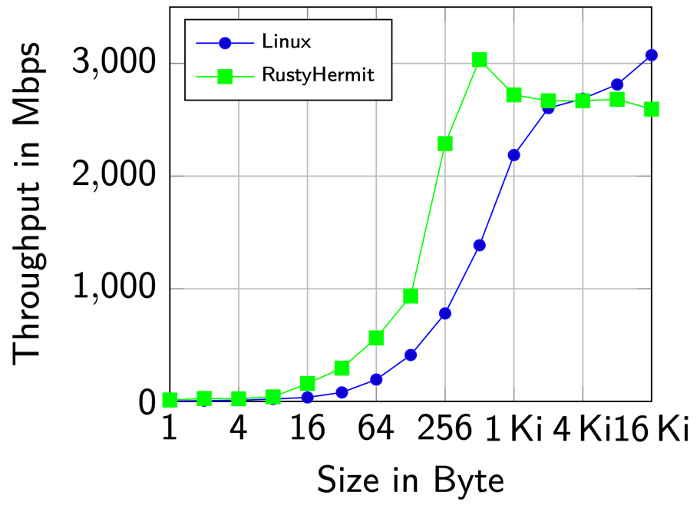

## RustyHermit

RustyHermit([Github](https://github.com/hermitcore/rusty-hermit)) 是一个基于 Rust 的、轻量级的 Unikernel。它用 Rust 语言完全改写了 RWTH Aachen University 开发的研究项目 [HermitCore](http://hermitcore.org/)。

> HermitCore 最初是用 C 语言编写的，是一种针对高性能和云计算的可伸缩和可预测的运行时的 Unikernel。
>
> 参考资料：[rusty-hermit 0.3.10 doc](https://docs.rs/crate/rusty-hermit/0.3.10)

该项目完全使用 Rust 语言开发，**Rust 的所有权模型保证了它的内存/线程安全**，并且让开发者能够在编译时就消除许多种 bug。因此，与通用编程语言相比，使用 Rust 进行内核开发会留下更少的漏洞，得到更加安全的内核。

开发者**扩展了 Rust 工具链**以至于 RustyHermit 的 build 过程与 Rust 通常的工作流程相似。使用 Rust runtime 而且不直接使用 OS 服务的 Rust 应用程序能够直接在 RustyHermit 上运行而不需要修改。因此，**原则上，每一个现有的 Rust 应用程序都可以建立在 RustyHermit 之上**。

> Rust runtime，翻译过来称为 Rust 运行时。其中 runtime 这个词在维基百科中的定义如下：
>
> - In computer science, **runtime**, **run time**, or **execution time** is <u>the final phase of a computer program's life cycle</u>, in which the code is being executed on the computer's central processing unit (CPU) as machine code. In other words, "runtime" is the running phase of a program.
>
> 由此可以将 runtime 简单理解为**程序代码被 CPU 执行的那段时间**。
>
> 参考资料：
>
> [Rust Runtime 与 ABI——知乎专栏](https://zhuanlan.zhihu.com/p/370897059)
>
> [Rust 运行时 - Rust 参考 (rust-lang.org)](https://doc.rust-lang.org/reference/runtime.html)

RustyHermit 中**优化实现了网络栈**。它使用 [smoltcp](https://github.com/smoltcp-rs/smoltcp) (Rust 语言编写) 作为它的网络栈，使用 [Virtio ](https://www.linux-kvm.org/page/Virtio) (KVM 的准虚拟化驱动程序，广泛应用于虚拟化 Linux 环境中) 作为客户机和主机操作系统之间的接口。将RustyHermit 和 Linux 分别作为客户端运行在基于 Linux 的主机系统上的虚拟机中，以信息的比特数作为自变量，吞吐量/Mbps作为因变量，进行测试并绘图，结果如下：

> 参考资料：
>
> [The `RustyHermit` Unikernel——Rust OSDev](https://rust-osdev.com/showcase/rusty-hermit/)

由结果图可以看出，**RustyHermit 在信息比特数较小时吞吐量明显比 Linux 更快**。

RustyHermit 也是一个用来评估操作系统新的设计的研究项目。比如，RustyHermit 提供了一些经典的技术来提升像堆栈保护、应用程序堆栈与操作系统库堆栈分离等行为的安全性。但是，库操作系统通常使用一个普通函数调用进入内核，传统的通过进入更高的权限级别来将用户空间和内核空间分离的做法是被遗漏了的。

有[一篇论文](../../references/Intra-Unikernel Isolation with Intel Memory Protection Keys.pdf)中提出了**一个修改版本的 RustyHermit**，该版本提供了一个**使用 Intel MPK**(Memory Protection Keys)**进行内部隔离**的Unikernel。这篇论文的摘要如下（中英文对照）：

> Abstract：
>
> Unikernels are minimal, single-purpose virtual machines. This new operating system model promises numerous benefits within many application domains in terms of lightweightness, performance, and security. Although the isolation between unikernels is generally recognized as strong, there is no isolation within a unikernel itself. This is due to the use of a single, unprotected address space, a basic principle of unikernels that provide their lightweightness and performance benefits. In this paper, we propose a new design that brings memory isolation inside a unikernel instance while keeping a single address space. We leverage Intel’s Memory Protection Key to do so without impacting the lightweightness and performance benefits of unikernels. We implement our isolation scheme within an existing unikernel written in Rust and use it to provide isolation between trusted and untrusted components: we isolate (1) safe kernel code from unsafe kernel code and (2) kernel code from user code. Evaluation shows that our system provides such isolation with very low performance overhead. Notably, the unikernel with our isolation exhibits only 0.6% slowdown on a set of macrobenchmarks.
>
> 译：
>
> Unikernels 是最小的、单一用途的虚拟机。这种新的操作系统模型在许多应用程序领域中承诺了轻量化、性能和安全性方面的许多好处。虽然 Unikernels 之间的隔离通常被认为是很强的，但是在 Unikernels 本身内部并没有隔离。这是因为使用了单一的、不受保护的地址空间，这是提供轻量级和性能优势的 Unikernels 的基本原则。在本文中，我们提出了一种新的设计，即在保持单一地址空间的同时，在 Unikernel 实例中引入内存隔离。我们利用 Intel 的内存保护密钥(MPK)来做到这一点，而不会影响 Unikernels 的轻量化和性能优势。我们在<u>现有的用 Rust 编写的 Unikernel</u> 中实现了我们的隔离方案，并使用它来提供可信和不可信组件之间的隔离：(1)安全内核代码与不安全内核代码之间的隔离，(2)内核代码与用户代码之间的隔离。评估表明，我们的系统以非常低的性能开销提供了这种隔离。值得注意的是，在一组宏基准测试中，带有隔离功能的 unikernel 仅减慢了0.6%。

> **注**：上面提到的“<u>现有的用 Rust 编写的 Unikernel</u>”就是指 RustyHermit。
>
> 参考资料：
>
> [Intra-Unikernel Isolation with Intel Memory Protection Keys.pdf](../../references/Intra-Unikernel Isolation with Intel Memory Protection Keys.pdf)
>
> [MPK——Core API Doc](https://www.kernel.org/doc/html/latest/core-api/protection-keys.html#:~:text=Memory%20Protection%20Keys%20provides%20a%20mechanism%20for%20enforcing,to%20a%20%E2%80%9Cprotection%20key%E2%80%9D%2C%20giving%2016%20possible%20keys.)
>
> [linux内核那些事之Memory protection keys(硬件原理)——CSDN博客](https://blog.csdn.net/weixin_42730667/article/details/121386896)

这篇论文中的内容可以作为我们实现 runikraft 的参考。

## Rumprun

未完待续
