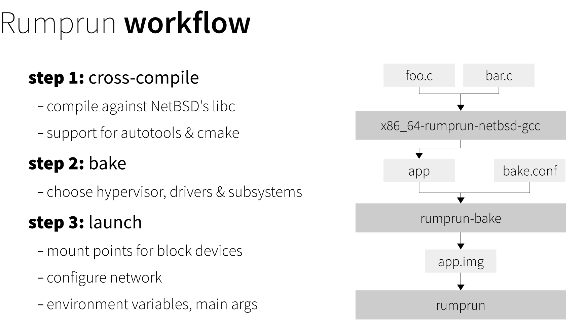

## RustyHermit

RustyHermit([Github](https://github.com/hermitcore/rusty-hermit)) 是一个基于 Rust 的、轻量级的 Unikernel。它用 Rust 语言完全改写了 RWTH Aachen University 开发的研究项目 [HermitCore](http://hermitcore.org/)。

> HermitCore 最初是用 C 语言编写的，是一种针对高性能和云计算的可伸缩和可预测的运行时的 Unikernel。
>

该项目完全使用 Rust 语言开发，**Rust 的所有权模型保证了它的内存/线程安全**，并且让开发者能够在编译时就消除许多种 bug。因此，与通用编程语言相比，使用 Rust 进行内核开发会留下更少的漏洞，得到更加安全的内核。

开发者**扩展了 Rust 工具链**以至于 RustyHermit 的 build 过程与 Rust 通常的工作流程相似。使用 Rust runtime 而且不直接使用 OS 服务的 Rust 应用程序能够直接在 RustyHermit 上运行而不需要修改。因此，**原则上，每一个现有的 Rust 应用程序都可以建立在 RustyHermit 之上**。

> Rust runtime，翻译过来称为 Rust 运行时。其中 runtime 这个词在维基百科中的定义如下：
>
> - In computer science, **runtime**, **run time**, or **execution time** is <u>the final phase of a computer program's life cycle</u>, in which the code is being executed on the computer's central processing unit (CPU) as machine code. In other words, "runtime" is the running phase of a program.
>
> 由此可以将 runtime 简单理解为**程序代码被 CPU 执行的那段时间**。
>

RustyHermit 中**优化实现了网络栈**。它使用 [smoltcp](https://github.com/smoltcp-rs/smoltcp) (Rust 语言编写) 作为它的网络栈，使用 [Virtio ](https://www.linux-kvm.org/page/Virtio) (KVM 的准虚拟化驱动程序，广泛应用于虚拟化 Linux 环境中) 作为客户机和主机操作系统之间的接口。将RustyHermit 和 Linux 分别作为客户端运行在基于 Linux 的主机系统上的虚拟机中，以信息的比特数作为自变量，吞吐量/Mbps作为因变量，进行测试并绘图，结果如下：

由结果图可以看出，**RustyHermit 在信息比特数较小时吞吐量明显比 Linux 更快**。

RustyHermit 也是一个用来评估操作系统新的设计的研究项目。比如，RustyHermit 提供了一些经典的技术来提升像堆栈保护、应用程序堆栈与操作系统库堆栈分离等行为的安全性。但是，库操作系统通常使用一个普通函数调用进入内核，传统的通过进入更高的权限级别来将用户空间和内核空间分离的做法是被遗漏了的。

有[一篇论文](../../references/Intra-Unikernel Isolation with Intel Memory Protection Keys.pdf)中提出了**一个修改版本的 RustyHermit**，该版本提供了一个**使用 Intel MPK**(Memory Protection Keys)**进行内部隔离**的Unikernel。这篇论文的摘要如下（中英文对照）：

> Abstract：
>
> Unikernels are minimal, single-purpose virtual machines. This new operating system model promises numerous benefits within many application domains in terms of lightweightness, performance, and security. Although the isolation between unikernels is generally recognized as strong, there is no isolation within a unikernel itself. This is due to the use of a single, unprotected address space, a basic principle of unikernels that provide their lightweightness and performance benefits. In this paper, we propose a new design that brings memory isolation inside a unikernel instance while keeping a single address space. We leverage Intel’s Memory Protection Key to do so without impacting the lightweightness and performance benefits of unikernels. We implement our isolation scheme within an existing unikernel written in Rust and use it to provide isolation between trusted and untrusted components: we isolate (1) safe kernel code from unsafe kernel code and (2) kernel code from user code. Evaluation shows that our system provides such isolation with very low performance overhead. Notably, the unikernel with our isolation exhibits only 0.6% slowdown on a set of macrobenchmarks.
>
> 译：
>
> Unikernels 是最小的、单一用途的虚拟机。这种新的操作系统模型在许多应用程序领域中承诺了轻量化、性能和安全性方面的许多好处。虽然 Unikernels 之间的隔离通常被认为是很强的，但是在 Unikernels 本身内部并没有隔离。这是因为使用了单一的、不受保护的地址空间，这是提供轻量级和性能优势的 Unikernels 的基本原则。在本文中，我们提出了一种新的设计，即在保持单一地址空间的同时，在 Unikernel 实例中引入内存隔离。我们利用 Intel 的内存保护密钥(MPK)来做到这一点，而不会影响 Unikernels 的轻量化和性能优势。我们在<u>现有的用 Rust 编写的 Unikernel</u> 中实现了我们的隔离方案，并使用它来提供可信和不可信组件之间的隔离：(1)安全内核代码与不安全内核代码之间的隔离，(2)内核代码与用户代码之间的隔离。评估表明，我们的系统以非常低的性能开销提供了这种隔离。值得注意的是，在一组宏基准测试中，带有隔离功能的 unikernel 仅减慢了0.6%。

> **注**：上面提到的“<u>现有的用 Rust 编写的 Unikernel</u>”就是指 RustyHermit。

这篇论文中的内容可以作为我们实现 runikraft 的参考。

## Rumprun

Rumprun unikernel 是在 rump kernels 的基础上开发的。Rumprun 不仅可以**在像 KVM 和 Xen 这样的管理程序上工作**，还**可以在裸金属上工作**。**无论有没有 POSIX-y 接口，Rumprun 都可以正常使用**。如果有 POSIX-y 接口，Rumprun 则允许现有的、未经修改的 POSIX 应用程序开箱即用；如果没有 POSIX-y 接口，Rumprun 则允许构建高度自定义的解决方案，并且占用的空间最小。

Rumprun unikernel 支持用 c、 c + + 、 Erlang、 Go、 Java、 Javascript (node.js)、 Python、 Ruby 和 Rust 等语言编写的应用程序。

在 [rumprun-packages repository](https://github.com/rumpkernel/rumprun-packages) 中可以找到用于 Rumprun 的现成软件包，比如 *LevelDB*, *Memcached*, *nanomsg*, *Nginx* 和 *Redis*。

### Rump kernels 的相关介绍

Rump kernels 的目标并不是搭建一个 unikernel，它的目标是提供可重用的内核组件，其他组件可以在此基础上进行构建。开发者的目标是让每个使用它们组件的项目都不用去花费精力维护轮子。

Rump kernels 的组件来自未经修改的 NetBSD，由此开发者提供了一个 POSIX-y API。Rump Kernel 项目以一种可用于构建轻量级、特殊用途虚拟机的形式提供了 NetBSD 的模块化驱动程序。因为开发者没有做会将错误引入到应用程序运行时(application runtime)、 libc 或驱动程序中的移植工作，所以程序可以很稳定地工作。下面这张图片阐述了 Anykernel、Rump kernel 和 Rumprun Unikernel 的关系：

> “Anykernel”概念指的是一种与架构无关的驱动程序方法，在这种方法中，驱动程序既可以编译到宏内核中，也可以作为用户空间进程运行，具有微内核风格，并且不需要修改代码。——来自维基百科
>

### Rumprun 的相关介绍

目前已经有很多 Unikernel 项目，它们的实现方式大致可以分为两种：

- 全新的方式(Clean-slate)：在构建单一用途的操作系统的假设下，自由地使用现代工具来进行构建，比如模块化(modularity)、声明性代码(declarative code)、避开样板文件(avoiding boilerplate)等。并且从头开始思考操作系统和应用程序层的实现，使用高级语言进行系统库的编写，从而使得实现更加可掌控，得到的系统库质量更高。
- 传统的方式(Legacy)：在不进行修改或只进行一些小的修改的前提下，运行现有的软件。这通常通过将现有的操作系统代码库重构到库操作系统中来实现。

用 OCmal 语言编写的 MirageOS Unikernel 就是使用 Clean-slate 方式实现的，而用 C 语言编写的 Rumprun Unikernel 则是使用 Legacy 方式实现的。

Rumprun 可用于将几乎任何与 POSIX 兼容的程序转换为一个可工作的 Unikernel。使用 Rumprun，理论上可以将 Linux 或者 类Unix系统上的大部分程序编译成 Unikernel。Rumprun 以开发 NetBSD 内核中的驱动程序并在用户空间中进行测试的需求为出发点，主要的工作是重构这个代码库，使其看起来像一个库操作系统。

下面是 Rumprun 的**架构图**：

Rumprun 也有一些**限制**：

- **single address-space**
  - no processes
  - no virtual memory
  - no signals
- **toolchain**
  - still experimental
- **threading**
  - cooperative
  - single-core
    - need to spawn multiple unikernels to use multiple cores

下图是 Rumprun 的一个**工作流程示例图**：

我在调研的过程中发现，rump kernel 的好多官方文档都会重定向到https://rumpkernel.org这个网址，而这个网址目前只有一些 IT News，并非和 rump kernel 相关的内容，所以**猜测该项目目前已经无人维护**。

此外，我在调研过程中还**发现一个比较新的正在开发中的 Unikernel**：[Nanos(Github)](https://github.com/nanovms/nanos)。下面是它的一些介绍：

> Nanos 是一个新的内核，旨在虚拟化环境中运行一个且仅有一个应用程序。与 Windows 或 Linux 等通用操作系统相比，它有几个限制——即它是一个单进程系统，不支持运行多个程序，也不具备通过 ssh 进行用户或远程管理的概念。
>
> Nanos 的目标是成为一个比 Linux 安全得多的系统。它做到这一点的几个依赖：**没有用户的概念**，**每个虚拟机只运行一个进程**，**限制每个虚拟机中包含的代码数量**。
>
> Nanos 并不打算在裸金属上运行，所以开发者努力使**其内核尽可能简单**。

这也许会对我们的项目有所帮助。

## 参考资料

- [rusty-hermit 0.3.10 doc](https://docs.rs/crate/rusty-hermit/0.3.10)
- [Rust Runtime 与 ABI——知乎专栏](https://zhuanlan.zhihu.com/p/370897059)
- [Rust 运行时 - Rust 参考 (rust-lang.org)](https://doc.rust-lang.org/reference/runtime.html)
- [The `RustyHermit` Unikernel——Rust OSDev](https://rust-osdev.com/showcase/rusty-hermit/)
- [Intra-Unikernel Isolation with Intel Memory Protection Keys.pdf](../../references/Intra-Unikernel Isolation with Intel Memory Protection Keys.pdf)
- [MPK——Core API Doc](https://www.kernel.org/doc/html/latest/core-api/protection-keys.html#:~:text=Memory%20Protection%20Keys%20provides%20a%20mechanism%20for%20enforcing,to%20a%20%E2%80%9Cprotection%20key%E2%80%9D%2C%20giving%2016%20possible%20keys.)
- [linux内核那些事之Memory protection keys(硬件原理)——CSDN博客](https://blog.csdn.net/weixin_42730667/article/details/121386896)
- [Rump kernel——Wikipedia (其中有介绍 Anykernel)](https://en.wikipedia.org/wiki/Rump_kernel)
- [Xen on Rump Kernels and the Rumprun Unikernel——XenProject](https://xenproject.org/2015/08/06/on-rump-kernels-and-the-rumprun-unikernel/)
- [All About Unikernels: Part 2, Two Different Approaches, MirageOS and Rumprun——Container Solutions blog](https://blog.container-solutions.com/all-about-unikernels-part-2-mirageos-and-rumprun)
- [The Rumprun Unikernel](../../references/The Rumprun Unikernel.pdf)
